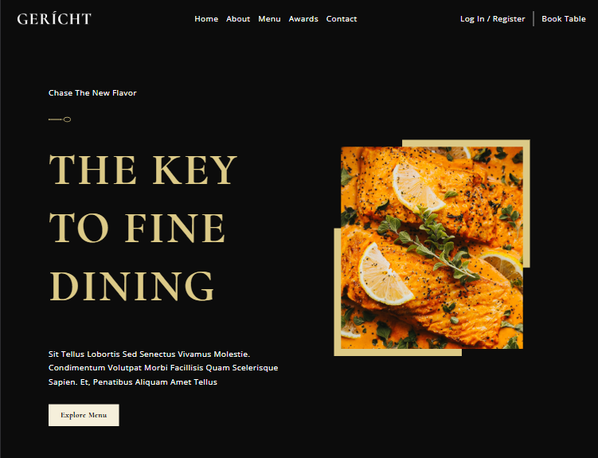

<div>
 <h1 borderBottom=" align="center">Gericht Restaurant</h1>
</div>

<ul align="center">
    <a href="#about">Sobre |</a> 
    <a href="#started">Primeiros passos</a> 
    <a href="#routes">| App Routes</a> 
</ul>


  


<p align="center">
    
</p>

<h2 id="about">📌 Sobre</h2>

**Gericht Restaurant** é uma aplicação UI/UX desenvolvida com ReactJS, focada na experiência de exploração gastronômica. O projeto se destaca por sua seção principal envolvente, visuais de alta qualidade, um menu rico e interativo, além de funcionalidades cativantes.

<h2 id="started">🚀 Primeiros passos</h2>

Foram utilizados duas bibliotecas a parte no repositório:

- Phosphor Icons
- Sass

<h3>Clonar</h3>

```bash
git clone https://github.com/RafaelHDSV/Gericht-Restaurant.git
yarn install
```

<h3>Iniciar</h3>

```bash
cd Gericht-Restaurant
yarn start
```

<h2 id="routes">📍 Rotas da aplicação</h2>

O projeto inteiro posso uma única rota, não sendo necessário o controle e manutenção de outras rotas na aplicação
​
| route | description  
|----------------------|-----------------------------------------------------
| <kbd>/</kbd> | página inicial

<hr/>

### route: <kbd>/</kbd>

