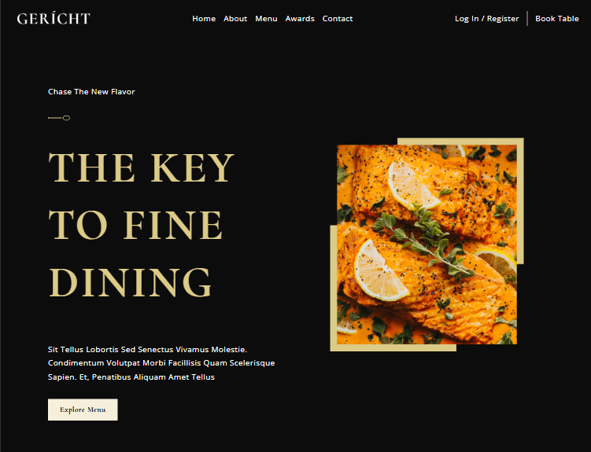

<div align="center">
  <h1>Gericht Restaurant</h1>
</div>

<div align="center" style='margin-bottom: 1rem'>
  <a href="#about">Sobre</a> |
  <a href="#started">Primeiros Passos</a> |
  <a href="#routes">Rotas</a>
</div>

<div align="center">
  
  
  
  
  
  
</div>

<p align="center">
  
</p>

## 📌 Sobre <a id="about"></a>

**Gericht Restaurant** é uma aplicação de UI/UX desenvolvida com **ReactJS** que simula uma experiência imersiva de exploração gastronômica.  
Os destaques do projeto incluem:  
- Seção principal envolvente e visualmente rica.  
- Design responsivo e moderno.  
- Menu interativo com funcionalidades intuitivas.  

## 🚀 Primeiros Passos <a id="started"></a>

Este projeto utiliza as seguintes bibliotecas adicionais:  
- **Phosphor Icons**: Para ícones elegantes e flexíveis.  
- **Sass**: Para gerenciamento avançado de estilos.

### Clone o repositório

```bash
git clone https://github.com/RafaelHDSV/Gericht-Restaurant.git
```

### Instale as dependências
```bash
yarn install
```

### Inicie o projeto
```bash
cd Gericht-Restaurant
yarn start
```

## 📍 Rotas <a id="routes"></a>
O projeto possui uma única rota, simplificando a navegação e manutenção:

| Rota | Descrição
| ---|---
| <kbd>/</kbd> |	Página inicial do projeto

### Visualização da página inicial

<p align="center">  </p>
## Apoie

<a href="https://www.buymeacoffee.com/vieira" target="_blank"></a>
